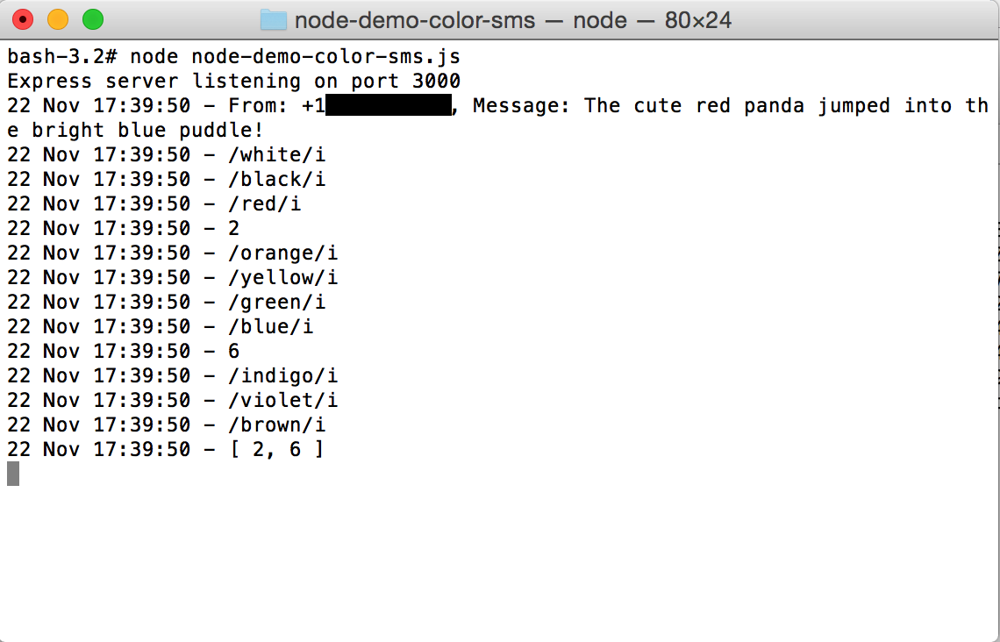
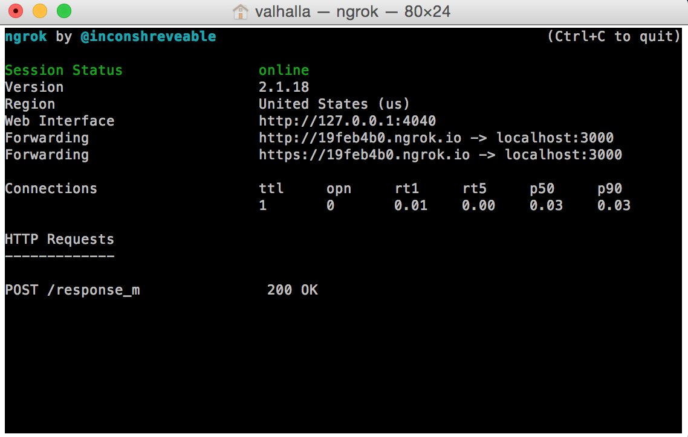
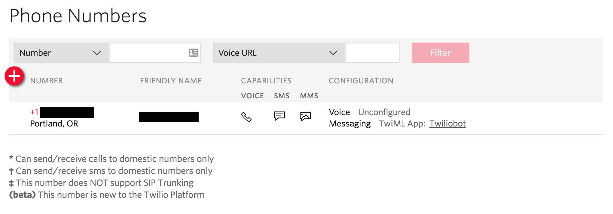
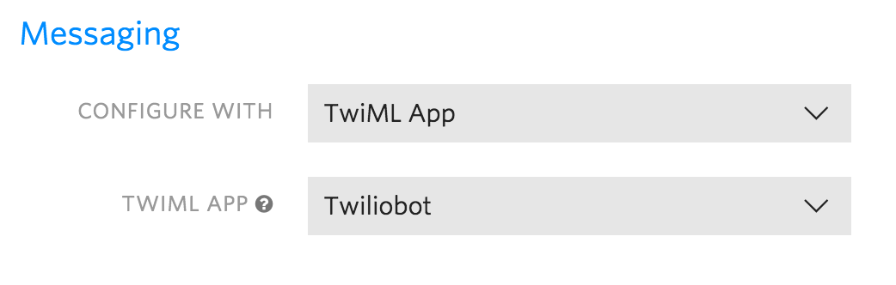
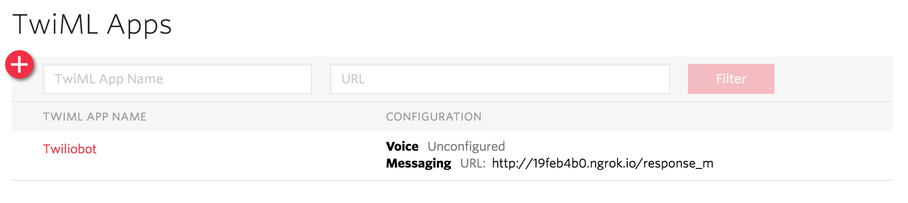

# node-demo-color-sms

<h1>Demo of SMS Parsing using Node.js, Twilio and ngrok</h1>

I had the vague idea of an interactive art installation consisting of a responsive environment that changes colors based on user input. Not entirely original, nor a fully formed idea, but an idea nontheless! 

One method of user interaction I considered was via text messaging. More specifically, the environment encourages users to send it messages which would then be parsed for "mood" and the interpreted mood would be used to change the color of the environment. I decided to test out the first step of such an interaction by simply parsing out specific colors words from a text message. To do this, I threw together this demo using Node.js, Twilio and ngrok.

<h1>THE RESULT</h1>

Simply send a text (SMS) to a Twilio number, and receive a response back of parsed color words from the original message.

Nothing mind-blowing, but it's an exciting feeling the first time your phone buzzes with an automated text message using something you created!

<h1>WHAT MAKES IT TICK</h1>

This demo consists of three parts:
<ol>
<li>A Node.js server running on a localhost port.</li>
<li>An ngrok tunnel pointing to said localhost port.</li>
<li>A Twilio phone number with SMS messaging pointing to the ngrok tunnel.</li>
</ol>

<h2> Node.js Server</h2>

The Node.js server is a relatively simple script that (i) receives a Twilio SMS message, (ii) parses the message string for any matching color words, and (iii) sends back a Twilio SMS response.

To start the Node.js server, simply run the following command in an OSX terminal...<code>node node-demo-color-sms.js</code>. This should use port 3000 by default (as does the ngrok tunnel), so if you want to use a different port, plan accordingly.

NOTE: This demo uses an environment variable to authenticate the Twilio service, so make sure you run <code>export TWILIO_AUTH_TOKEN=[your-twilio-auth-token]</code> in the terminal before initializing the Node.js server.

<h2>Ngrok Tunnel</h2>

The ngrok tunnel is used to point a public ngrok url at the localhost port where the Node.js server is running (default port 3000).

NOTE: After starting the ngrok tunnel, I simply copied the Forwarding URL (HTTP) from the terminal window and pasted it into the Twilio TwiML configuration as shown in the next section.

<h2>Twilio Phone Number</h2>

And finally, the Twilio phone number is configured with a TwiMIL app that directs SMS Messaging to the ngrok url (and Node.js server endpoint) via HTTP Post.

In this configuration, I'm using a TwiML app named 'Twiliobot' instead of directly configuring the Messaging response with TwiML/Webhooks. Either way works, I just wanted to try out the TwiML app management.

<h1>FIN</h1>

And that's it! Sort of. 

It will take a bit of trial and error to get the localhost Node.js server, ngrok tunnel, and Twilio TwiML configuration all working happily together. But between Node.js errors, ngrok HTTP response codes, and Twilio debugging alerts, it's relatively painless to troubleshoot when things aren't working.

<h1>REFERENCES</h1>
Some useful references in no particular order...
<ul>
<li><a href="https://www.twilio.com/docs/guides/sms/how-to-receive-and-reply-in-node-js#generating-twiml-in-your-web-application
">https://www.twilio.com/docs/guides/sms/how-to-receive-and-reply-in-node-js#generating-twiml-in-your-web-application
</a></li>
<li><a href="http://stackoverflow.com/questions/14556426/how-can-i-respond-to-incoming-twilio-calls-and-sms-messages-using-node-js">http://stackoverflow.com/questions/14556426/how-can-i-respond-to-incoming-twilio-calls-and-sms-messages-using-node-js</a></li>
<li><a href="https://twilio.github.io/twilio-node/">https://twilio.github.io/twilio-node/</a></li>
<li><a href="https://www.twilio.com/blog/2014/01/secure-your-nodejs-webhooks-with-middleware-for-express-middleware.html">https://www.twilio.com/blog/2014/01/secure-your-nodejs-webhooks-with-middleware-for-express-middleware.html</a></li>
</ul>
